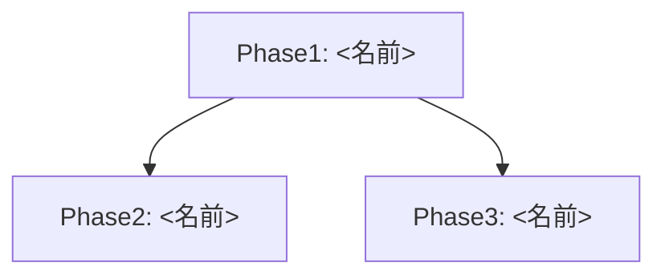

# Roadmapスキル

3つ以上のチケットに分かれる規模の仕事や、中長期の変化を扱う場合にロードマップを作る。

## 配置

配置先は次の優先順位で決める。

1. 指定がある場合その配置を使う。
2. ワークスペース慣例に従う。`docs/roadmaps`、`roadmaps` など、実際の構成と命名に合わせる。
3. 1,2に該当しない場合、ユーザーに配置先を確認する。勝手に新しいディレクトリを増やさない。

ファイル名は既存の規約に合わせる。規約が示されていない場合 `roadmap-v{nn}_{タイトル}.md` とする。

## テンプレート

~~~md
# Roadmap-v{n}: {ロードマップ名}

## Concept
{背景/痛み/要望と、目指すゴールを20行程度で記載。フェーズを経た先の未来を明確に。抽象語に逃げず、具体的な変化を物語として書く。スコープ外・未決事項があれば末尾に明示。}

## Map

## Phases

### P01: {フェーズ名}
**Why**
{Concept達成のためにこのフェーズがなぜ必要なのか、どのように寄与するのかを2-3行で記載}

**WHAT**
{このフェーズで何をやるのか、その要約をまとめる。実行時に迷わない程度の粒度まで記載}

**Steps**
- [ ] {フェーズステップ}

**Gates**
- [ ] {品質ゲート}

## Gates
- [ ] {全フェーズ完了時の品質ゲート。全完了=Conceptの未来が実現されている}

## Notes
{策定時のメモ、想定外への備え、参考資料リンクなど}
~~~

## 運用

- フェーズの順序と依存関係を `Map` に表す。
- 各フェーズには `Why`、`WHAT`、`Steps`、`Gates` を置く。
- 各フェーズは完結したPRとなるように組む。目安は500-2000行程度だが意味的まとまりを重視する。

## 備考

- 実行しないと全てを見通せない場合、`[TODO] 実行時見直し：{見直すべき観点}`を簡潔に記載する。